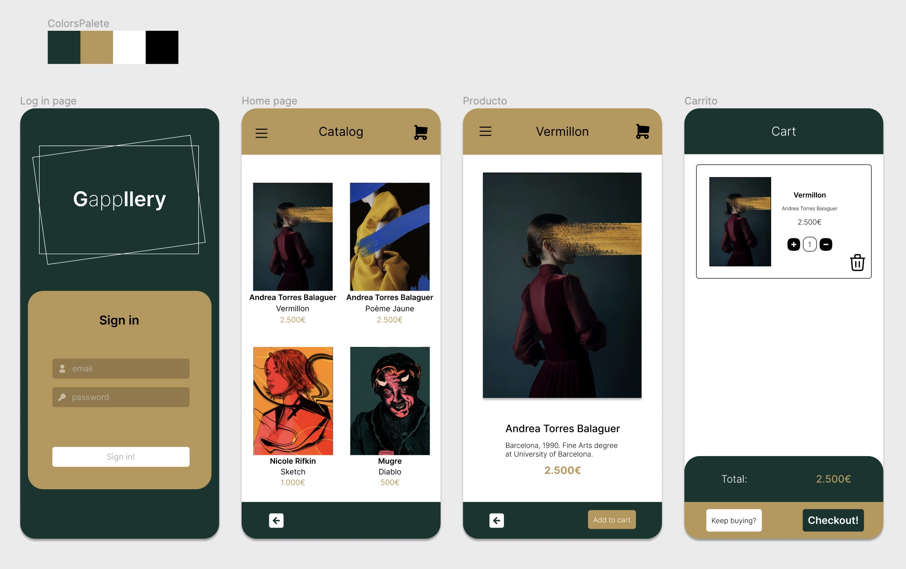
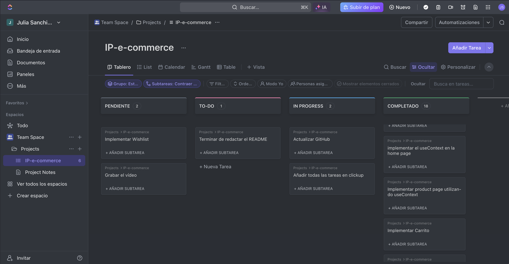

`#react` `#assembler-institute-of-technology` `#master-in-software-engineering` `#ReactEcommerce` `#ReactTS` `#ReactHooks` `#CustomHooks` `#StyledComponents` `#TypeScript` `#CSS` `#Figma` `#ReactOptimization`

# Individual Proyect E-Commerce 📱

In this projects we have to implement an e-commerce platform called Gappllery, where you can find beautiful paintings and photographies.


Step 1 consisted in designing the look with Figma:



- [My Figma Design](https://www.figma.com/file/U35G4p5b1lsH6H5Gu5hXFX/Proyecto-individual?type=design&node-id=21%3A1009&mode=design&t=5UO7oWfqrxsB1cOx-1)

Also create my project in ClickUp:



In step 2, I had to install pnpm package manager instead of npm and Vite frontend tool to start the project.

Step 3 involved installing React and React Router.

With all my tools installed and ready to go, let's build the project!

## Extra tools used ✨

- [React Hot Toast](https://react-hot-toast.com)
- [React Icons](https://react-icons.github.io/react-icons/)

## Journal 🗒️

· 5th February 2014:

- Watching some videos and reading some articles about Figma and React.

· 6th February 2014:

- Designing my app layout on Figma.

· 7th February 2014:

- Continue designing my app layout on Figma.

· 8th February 2014:

- Finishing my app layout on Figma.

· 9th February 2014:

- Starting my project on VisualStudio Code and installing all the tools I need.

· 12th February 2014:

- Creating a GitHub repository, pushing my brand new project from VS Code.

- Building the folders and file structure.

- Creating my json files with the information about users and products, wich are:

### 🙂 Users

```bash
[
  {
    "name": "Julia Sanchis",
    "username": "jsanchis",
    "mail": "jusanchis@example.com",
    "password": "quierodormir",
    "cart": [],
    "whishlist": []
  },
  {
    "name": "Dani Sanguino",
    "username": "sanguineta",
    "mail": "sanguineta@example.com",
    "password": "iloveborderradius",
    "cart": [],
    "whishlist": []
  },
  {
    "name": "Maria Cidoncha",
    "username": "cidonchat",
    "mail": "janesmith@example.com",
    "password": "tengohambre",
    "cart": [],
    "whishlist": []
  },
  {
    "name": "Jorge Revuelta",
    "username": "jorgerc",
    "mail": "jdaltonico@example.com",
    "password": "vivazaragoza7",
    "cart": [],
    "whishlist": []
  },
  {
    "name": "Paula Wilshaw",
    "username": "paulawil",
    "mail": "paulawil@example.com",
    "password": "mencantajere",
    "cart": [],
    "whishlist": []
  },
  {
    "name": "Alberto Otero",
    "username": "albotero",
    "mail": "aoteron@example.com",
    "password": "ahoravoy",
    "cart": [],
    "whishlist": []
  },
  {
    "name": "Alba Martin",
    "username": "albam",
    "mail": "aoteron@example.com",
    "password": "nopuedomas",
    "cart": [],
    "whishlist": []
  }
]

```

### 🖼️ Painting

```bash
[
  {
    "id": 1,
    "name": "Vermillon",
    "img": "src/assets/vermillon.webp",
    "year": 2019,
    "author": {
      "name": "Andrea Torres Balaguer",
      "authordescription": "Barcelona, 1990. Fine Arts Degree at University of Barcelona."
    },
    "price": 2500
  },
  {
    "id": 2,
    "name": "Poème Jaune",
    "img": "src/assets/jeune.webp",
    "year": 2019,
    "author": {
      "name": "Andrea Torres Balaguer",
      "authordescription": "Barcelona, 1990. Fine Arts Degree at University of Barcelona."
    },
    "price": 2500
  },
  {
    "id": 3,
    "name": "Sketch",
    "img": "src/assets/sketch.webp",
    "year": 2019,
    "author": {
      "name": "Nicole Rifkin",
      "authordescription": "Canada. BFA in Communications Design (Illustration) and an MFA in Illustration from SVA."
    },
    "price": 1000
  },
  {
    "id": 4,
    "name": "Skies",
    "img": "src/assets/skies.webp",
    "year": 2019,
    "author": {
      "name": "Nicole Rifkin",
      "authordescription": "Canada. BFA in Communications Design (Illustration) and an MFA in Illustration from SVA."
    },
    "price": 1000
  },
  {
    "id": 5,
    "name": "Diablo",
    "img": "src/assets/diablo.webp",
    "year": 2019,
    "author": {
      "name": "Mugre",
      "authordescription": "Spain. Mid-century enthusiast graphic designer whose work centres around portraits."
    },
    "price": 500
  },
  {
    "id": 6,
    "name": "Ego Death",
    "img": "src/assets/egodeath.webp",
    "year": "2023",
    "author": {
      "name": "lacabezaenlasnubes",
      "authordescription": "Spain. His work is inspired by his early fondness on surrealism and psychedelia. The 'normal' perception of things has long ceased to interest him. He firmly believes that what we perceive through our senses is only the tip of the iceberg."
    },
    "price": 500
  }
]

```

· 13th February 2014:

- Dividing my pages as follows: Sign-In page, Home page, Product page (for the details) and Cart Page.

- Staring to build the HTML and CSS of the components I will need inside the Sign-In page.

· 14th February 2014:

- Continue building de components.

· 15th February 2014:

- Building the HTML and CSS of the components I will need inside Home page.

· 16th February 2014:

- Building the HTML and CSS of the components I will need inside Product page.

· 19th February 2014:

- Starting to implement the typescript functions into the Sign-In page. Trying to connect the users information with the inputs fields to validate the login.

· 20th February 2014:

- Finishing the implementation of the typescript functions into the Sign-In page.

· 21th February 2014:

- Implementing the typescript functions into Home and Product pages.

· 22th February 2014:

- Implementing routes and the protected routes to navigate through the app pages.

· 23th February 2014:

- Building the HTML and CSS of the components I need in the Cart page.

· 25th February 2014:

- Starting to implement the functions into the Cart page.

· 26th February 2014:

- Continue implementing the functions into the Cart page.

· 27th February 2014:

- Continue implementing and testing the functions into the Cart page.

· 28th February 2014:

- Finishing the Cart page and adding some code improvements.
